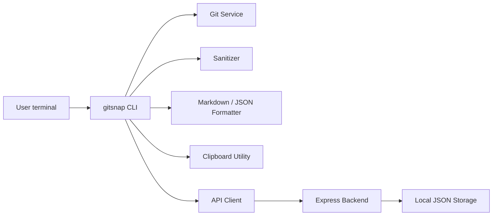

# gitsnap-cli

<p align="center">
  
</p>

<p align="center">
  <a href="https://opensource.org/licenses/MIT"></a>
  <a href="https://nodejs.org/"></a>
  <a href="https://github.com/lakshyakuruo-dot/gitsnap-cli"></a>
</p>

A production-ready Git snapshot CLI and backend for capturing sanitized repository context, formatting it into AI-ready Markdown, and optionally syncing snapshots to a local API.

## Overview

Gitsnap helps engineers paste safe, concise Git context directly into AI prompts without leaking secrets, tokens, or environment values. It captures:

- Current branch
- Git status output
- Git diff output
- Recent commit log metadata
- Optional backend sync to a local Express server
- Clipboard copy support for instant paste into Copilot, ChatGPT, Claude, and similar tools

## Architecture



## Features

- Safe repo validation with Git detection
- Secret masking for tokens, JWTs, private keys, and env values
- Markdown output tailored for AI prompt ingestion
- JSON output mode for tooling integration
- Clipboard copy support on supported desktops
- Optional backend upload with persistent storage
- Configurable endpoint and masking behavior

## Repository Structure

```text
gitsnap-cli/
├── bin/
│   └── index.js
├── server/
│   ├── index.js
│   ├── routes/
│   │   └── snapshot.js
│   └── storage/
│       └── db.js
├── src/
│   ├── api/
│   │   └── client.js
│   ├── cli.js
│   ├── commands/
│   │   ├── config.js
│   │   └── snap.js
│   ├── config.js
│   ├── formatters/
│   │   ├── jsonFormatter.js
│   │   └── markdownFormatter.js
│   ├── security/
│   │   ├── rules.js
│   │   └── sanitizer.js
│   ├── services/
│   │   ├── gitService.js
│   │   └── processService.js
│   ├── utils/
│   │   ├── clipboard.js
│   │   └── logger.js
│   └──
├── tests/
│   ├── gitService.test.js
│   └── sanitizer.test.js
├── .gitignore
├── LICENSE
├── package.json
├── README.md
└── package-lock.json
```

## Quick Start

### 1) Install dependencies

```bash
npm install
```

### 2) Link the CLI globally

```bash
npm link
```

This makes the binary available as:

```bash
gitsnap --help
```

### 3) Run a snapshot

From inside a Git repository:

```bash
gitsnap
```

You can also pass flags:

```bash
gitsnap --diff --json
gitsnap --upload
gitsnap --secret-mask
gitsnap --api-url http://localhost:4000/api
gitsnap --repo /path/to/repo
```

## Configuration

Configuration is stored in the user home directory under:

```text
~/.gitsnap-cli/config.json
```

Example:

```json
{
  "apiUrl": "http://localhost:4000/api",
  "secretMask": true
}
```

Manage config:

```bash
gitsnap config --show
gitsnap config --api-url http://localhost:4000/api
gitsnap config --reset
```

## CLI Flags

| Flag | Description |
| --- | --- |
| `-d, --diff` | Include diff output in the generated snapshot |
| `-j, --json` | Output structured JSON instead of Markdown |
| `-u, --upload` | Upload the generated snapshot to the configured backend |
| `-m, --secret-mask` | Force masking of sensitive values |
| `--no-secret-mask` | Disable secret masking |
| `--api-url <url>` | Override the configured backend base URL |
| `--repo <path>` | Use a Git repo located at a custom path |
| `config` | Open configuration management subcommand |

## Output Format

Generated Markdown looks like:

```markdown
## Git Context Snapshot
**Branch:** main

### Git Status
?? src/
 M README.md

### Git Diff
```diff
+ updated feature
- legacy code
```
```

## Backend API

The included Express service starts on port 4000 by default.

### Health endpoint

```http
GET /health
```

Example response:

```json
{
  "status": "ok",
  "service": "gitsnap-cli"
}
```

### Snapshot routes

```http
GET /api/snapshots
POST /api/snapshots
GET /api/snapshots/:id
```

### POST body

```json
{
  "repo": "/path/to/repository",
  "branch": "main",
  "status": "?? src/\n M README.md",
  "diff": "diff --git a/README.md b/README.md\n+ updated text",
  "commitLog": [
    {
      "hash": "abc123",
      "author": "Jane Doe",
      "message": "Improve documentation"
    }
  ],
  "generatedAt": "2026-09-01T00:00:00.000Z"
}
```

## Security & Sanitization

Sensitive data is removed before output is printed or uploaded. The sanitizer is designed to strip:

- `.env` variable values
- API keys and access tokens
- JWTs and bearer tokens
- Private key blocks
- Generic credential fields like `token`, `secret`, and `password`
- Git remote URLs with embedded credentials

This is a best-effort masking layer intended for safe prompt packaging and is not a substitute for secure secret management.

## Local Storage

Snapshots are stored in a lightweight local JSON store at:

```text
.data/snapshots.json
```

This is suitable for local development and small-scale persistence.

## Running the Backend Server

```bash
npm start
```

Or in watch mode:

```bash
npm run dev
```

## Testing

```bash
npm test
```

The test suite covers:

- secret masking behavior
- Git service output parsing
- repository context access patterns

## Contributing

Contributions are welcome. Please follow these steps:

1. Fork the repository.
2. Create a feature branch.
3. Make changes with tests where relevant.
4. Run the project verification commands.
5. Submit a pull request with a concise summary.

## License

This project is licensed under the MIT License. See [LICENSE](LICENSE) for details.

## Support

For issues, feature requests, or bug reports, open an issue in the GitHub repository.

---

Built for developers who want clean, safe Git context in AI workflows.
